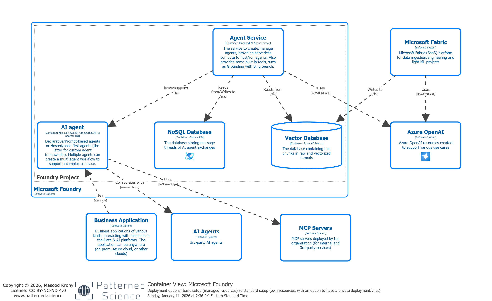
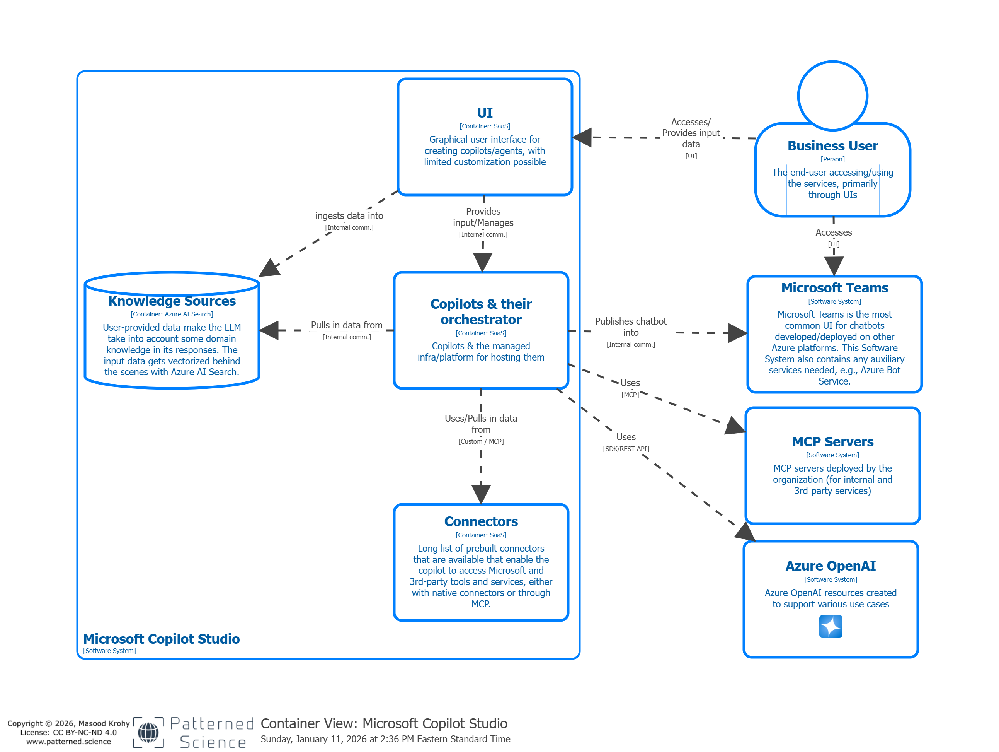
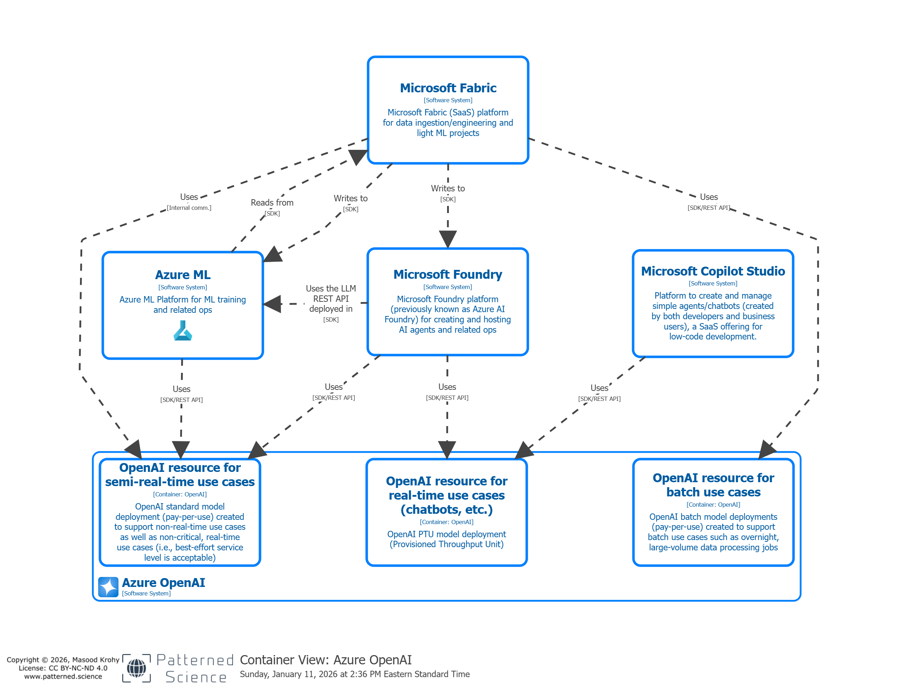

# Azure Data & AI Reference Architecture

The diagrams are available in an [interactive viewer](https://www.patterned.science/assets/architectures/azure/) as well as as a set of static images below:

## System Landscape Diagram

## Container View: Microsoft Foundry

## Container View: Azure ML

## Component View: Azure ML - Notebook/Code

## Component View: Azure ML - Endpoints

## Container View: Microsoft Copilot Studio

## Container View: Azure OpenAI

## Container View: Microsoft Fabric

## Component View: Microsoft Fabric - Data Storage Systems

## Component View: Microsoft Fabric - AI/ML Capabilities
