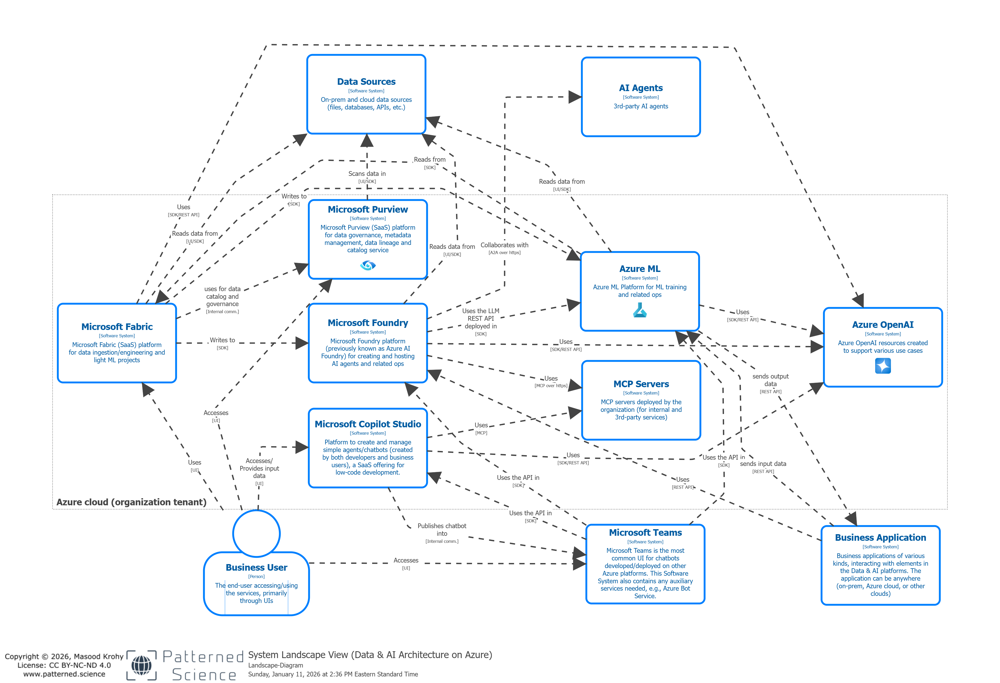

# Data & AI Reference Architectures (Azure, Databricks, AWS, Snowflake, OpenShift AI)

## Introduction

This repository contains a set of diagrams depicting detailed Data & AI Architecture on several public infrastructure and platforms, in the cloud and on-prem. The focus is on platform architecture, with some potential inter-platform communications displayed that are typically needed in a solution architecture. The following infra/platforms are covered:

- Azure: main data & AI platforms in Microsoft Azure have been covered and the architecture modeling/diagrams follow the C4 methodology ([interactive viewer](https://www.patterned.science/assets/architectures/azure/)).

- To come: OpenShift AI, Databricks, AWS, Snowflake

## Azure Data & AI Reference Architecture

### System Landscape Diagram

### Container and Component Diagrams
See a detailed set of diagrams [here](Azure-Data-AI-Architecture/Azure-Data-AI-Architecture.md).

## Contributions

Contributions to this repository are welcome! Please get in touch through the contact form on [www.patterned.science](https://www.patterned.science/) or open an issue in this GitHub repository to discuss. Architecture modeling with C4 methodology is encouraged, but other types of contributions will definitely be considered.

### License

[CC BY-NC-ND 4.0](https://creativecommons.org/licenses/by-nc-nd/4.0/deed.en)

Copyright © 2026 PatternedScience Inc.
